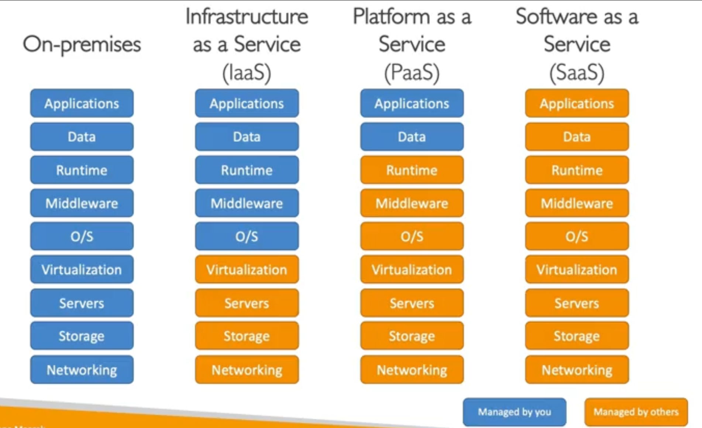
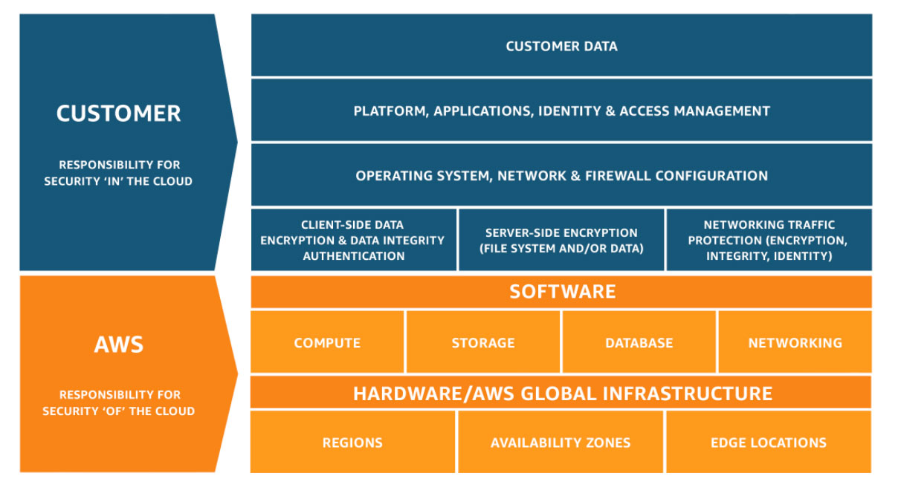

# Yankun's AWS Guide

**AWS cloud**, publicly launched in 2003, is basically Amazon selling its servers and various services for companies and people to use to build **sophisticated, scalable applications**. Some famous applications that use AWS Cloud are Dropbox, Airbnb, Netflix, and AWS maintains lead in the cloud market with 32% market share in 2023.

## AWS Cloud Computing

### What is Cloud Computing?

**Cloud Computing** is the on-demand delivery of compute power, database storage, and other IT resources, where you can provision exactly the right type and size you need.

*The Cloud is omnipresent*.

#### Cloud Deployment Models

* **Private**: *used by single organization*
* **Public**: *cloud resources delivered over the internet* (e.g. Microsoft Azure, Google Cloud, Amazon AWS)
* **Hybrid**: *some organizations keep some servers and extend some capabilities to the cloud*

#### Five Characteristics of Cloud Computing

* On-demand self service
* Broad network access
* Muti-tenancy and resource pooling (share resources)
* Rapid elasticity and Scalability (automatic get rid of waste and make big)
* Measured service (pay as you go)

### Different Types of Cloud Computing

There are three types of cloud computing:
* **IaaS**: *Infrastructure as a Service*
    * AWS provide only building blocks for cloud
    * e.g. Amazon EC2, Google GCP
* **PaaS**: *Platform as a Service*
    * AWS cover everything except application and data
    * e.g. AWS Elastic Beanstalk, Heroku
* **SaaS**: *Software as a Service*
    * Complete product run by AWS
    * e.g. AWS Rekognition ML, Zoom, Dropbox

### Pay-as-you-go Pricing

The **pay-as-you-go model** requires you to pay:
* **Compute**: Time
* **Storage**: Amount of data
* **Networking**: Data Out

### AWS Global Infrastructure

AWS is global which allows you to make your application global.

#### AWS Regions

*Def(**Region**)* Cluster of Data Center (e.g. us-east-1)

In order to choose a region, consider:

* **Compliance** with data governance and legal requirements
* **Proximity** to customer
* **Available Services** within certain regions
* **Pricing** varies between regions

#### AWS Availability Zones

Every region has 3 to 6 availability zones (AZ) (e.g. ap-sountheast-2a, ap-sountheast-2b). Each AZ is one or more discrete data centers with redundant power, networking, and connectivity.

AZs are disaster proof, and they link together to form regions.

#### AWS Points of Presence / Edge Locations

Amazon has 400+ points of presence in 90+ cities across 40+ countries.

#### Useful Links

* [AWS Global Infrastructure Map](https://aws.amazon.com/about-aws/global-infrastructure/regions_az/)
* [AWS Services by Region](https://aws.amazon.com/about-aws/global-infrastructure/regional-product-services/)

### AWS Shared Responsibility Model

* *Customer*: Responsibility **IN** the cloud
* *AWS*: Responsibility **OF** the cloud

